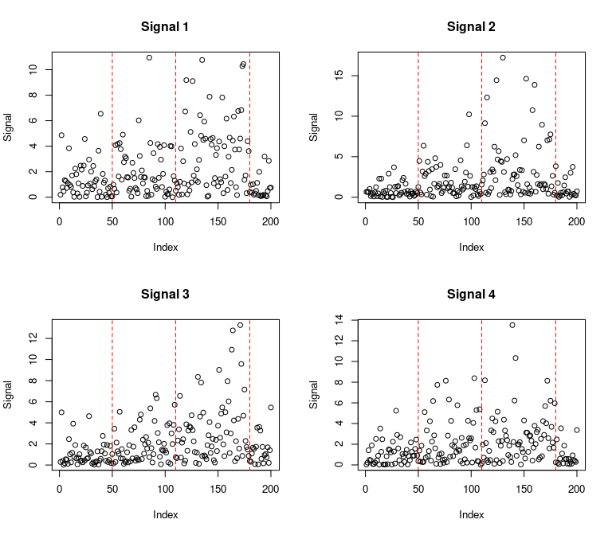
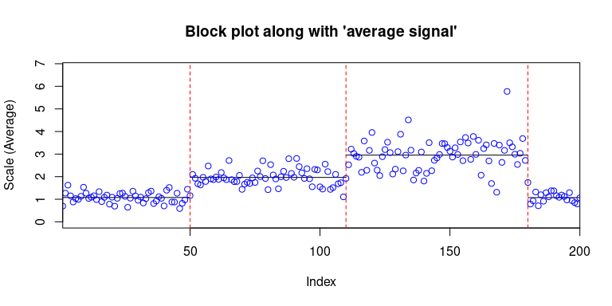
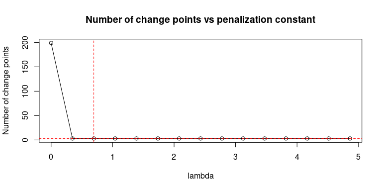
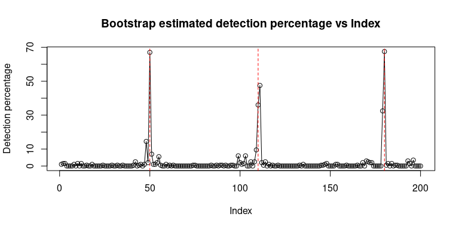

blockcpd: detecting multiple change-points in multiple signals
================

Welcome to `blockcpd`! This `R` package allows the user to fit
change-point detection models for the task of segmenting repeated
signals. It also provides tools for plotting, selecting and comparing
the fitted models.

The package tries to be ease of use, yet providing some flexibility. The
user can choose the fitting method, statistical family, basic
constraints and define his own penalization function.

For an in-depth mathematical formulation of the model and its
properties, see the reference on the end. Summarizing, it performs an
offline multiple change-point segmentation based on regularized
likelihood. The signals are assumed be independent and identically
distributed, and have the same size. We are interested in extending the
applicability in the future.

An interesting functionality the user might want to try is the
confidence plot: a graphic that shows the estimates of how likely it is
for a structural break to occur at a given index.

We now provide a quick tutorial on how to install the package, simulate
data, fit the model, avoid over-fitting, and exploring the confidence
plot feature.

## Installation

To install the package from this repository, install the
[devtools](https://cran.r-project.org/web/packages/devtools/index.html)
package and run the command below.

``` r
devtools::install_github("https://github.com/Lucas-Prates/blockcpd")
```

## Examples

### Simulating data

Lets simulate data with 20 signals (samples), each with variables,
segmented in four intervals: \[1,50\], \[51,110\], \[111,180\] and
\[181,200\]. We consider that the variables from each block comes from a
[exponential
distribution](https://en.wikipedia.org/wiki/Exponential_distribution)
with scale parameters 1, 2, 3 and 1 respectively.

To simulate from this model, we use the `rcpd` function provided by the
package. To pass the parameters, provide a list, where the keys are the
parameter name for the model, and the value is a vector whose entries
are the value of that parameter for each block. The blocks are specified
with the `changepoints` argument, which is a vector containing the end
point of each block except the last, in our case (50,110,180).

We also must specify the statistical family. Currently, the package
implements the Normal (Gaussian) with unknown mean and variance,
Poisson, Exponential, Bernoulli and Binary Markov Chain (2-states)
distributions.

``` r
library(blockcpd)
set.seed(42)
parameters = list(scale = c(1, 2, 3, 1))

# nrow = number of signals
# ncol = number of variables or observations per signal
sim_df <- rcpd(nrow = 20, ncol = 200, 
               family = "exponential", parameters = parameters,
               changepoints = c(50, 110, 180)) 
```

The output is a list with three elements: the data matrix, the true
change-points and parameters.

The figure below show how the first four signals look like. The vertical
dashed lines mark the location of the change-points.

<!-- -->

### Fitting the model

Now that we have a data set, we fit the model using the `fit_blockcpd`
function. The user can choose fitting method, statistical family,
maximum number of blocks and provide his own penalization function.

Two fitting methods are currently implemented: “hierseg” and “dynseg”.
The first is a fast greedy implementation of the hierarchical
segmentation (also called binary segmentation), and the second is
dynamic segmentation, an exact but slower implementation using dynamic
programming. The statistical methods are the same as discussed in the
simulations.

We will better discuss the penalization constant and maximum blocks in
the next section.

Lets fit the model using “hierseg” (default), the “exponential” family,
penalization constant equals 1.73 and default penalization.

``` r
  seg_model = fit_blockcpd(sim_df$data_matrix, family = "exponential", 
                           lambda = 1.73)
```

The return object is a S3 class called `blockcpd`. It contains the
estimated change-points, parameters, loss, negative log likelihood and
metadata. It also contains bootstrap information if the bootstrap flag
is `TRUE`. We will see why running the model with bootstrap can be
useful for the practitioner.

The user can plot how a parameter varies with the indices just by
calling `plot` and passing the model as an argument.

``` r
  plot(seg_model, parameter = "scale")
```

<!-- -->

The flat regions corresponds to variables grouped in the same block. The
height of the block corresponds to the estimated value of the parameter
for that block. The vertical lines shows where the model detected a
change-point. In this example, it detected the changes at (50,110,180),
which are the also true change-points.

Since the scale parameter is associated with the expected value of the
variables for the exponential distribution, we could plot a “average
signal” along with the block plot, as show in the figure below.

<!-- -->

The black lines are the estimated scale (average value) parameter for
the blocks, and the blue points are the average signal for each index.

### Avoiding over-segmentation

In order to avoid over segmentation, two parameters can be used: the
penalization constant (the `lambda` argument in `fit_blockcpd`) and the
maximum number of blocks (the `max_blocks` argument).

If we used a very small value for the penalization constant, we would
have detected many blocks, reaching a over-segmentation! However, we
only know it would have been a over-segmentation because we simulated
the data. We need an data-driven approach to select lambda.

The constant has to be chosen carefully. A common approach is to use an
adaptation of the [elbow
plot](https://en.wikipedia.org/wiki/Elbow_method_(clustering))
heuristics. A graphic of how the number of detect blocks varies with the
penalization constant lambda is constructed, and then we try to visually
select a value in which the curve “flats out” after it.

The package provides the `select_frv` function. The first function uses
a methodology similar to the described above in order to observe how the
estimated number of change-points vary with the penalization constant.
The main advantage is that it provides an automatic suggestion for the
best regularization constant, number of change-points and model.
Optionally, the user can call the `plot` function on its output in order
to do graphical inspection.

``` r
  model_args = list(family = "exponential") # do not include lambda!

  # search space for lambda
  lambda_left = 0
  lambda_right = 5
  step = "automatic" # can also be set to any numeric value
  
  # uses the data and passed arguments to fit the curve and suggested values
  frv = select_frv(sim_df$data_matrix, lambda_left = lambda_left, step = step,
                   lambda_right = lambda_right, 
                   model_args = model_args)
  
  # plots the curve if the user prefers to perform graphical inspection
  plot(frv)
```

<!-- -->

The function suggests an approximate value of 1.73 for the penalization
constant, justifying the value we used on the beginning. Plotting the
result is optional, but it can aid when the automatic suggestion fails.
**Do not restrict yourself to the suggestion, specially for very small
values of step.**

Another way to control over-segmentation is using the `max_blocks`
argument. When working with a large number of variables, if there is no
justification for a your signal to have a large number of blocks, try
setting small values for `max_blocks`. This will also make
`fit_blockcpd` run much faster.

### Is that change spurious? Check it with Confidence Plot

A central question is Statistics is: how confident are you on the fitted
model? How do you know the results you obtained are not spurious, that
is, they are not due to chance?

If you are a practitioner and your experience suggests that your signals
have a structural break at given location, it is not enough to fit a
model and detect a change at the location; you have to argue that, if
you repeated the experiment, you would consistently detect a change at
that location. This is the core of scientific inquiry.

To that end, we introduce the confidence plot. It plots the estimates of
how likely it is for the model to detect a change at any given point.
True structural breaks should have confidence near 100%, while non-break
indices should have a confidence near 0%. It might also be difficult to
detect a true change-point at the given sample size. In this case, it
should fluctuate in the middle.

The confidence is computed using bootstrap re-sampling. To create the
plot, we first need to refit the model passing the `TRUE` value to the
`bootstrap` argument. Then, we call the `confidence_plot` passing the
fitted model.

``` r
  seg_model = fit_blockcpd(sim_df$data_matrix, family = "exponential", 
                           lambda = frv$suggested_lambda, 
                           bootstrap = TRUE, bootstrap_samples = 200L)
  confidence_plot(seg_model, scale = "percentage")
```

<!-- -->

The plot shows the detection percentage of each index as a change-point.
The dashed vertical red lines shows the location of the final detected
change-points.

In this example, it is strongly suggested that 50 and 180 are true
change-points, but 110 also has a high detection value near 50%. Other
indices have somewhat low detection rates, suggesting that we indeed
only have 3 change-points. Notice that this plot can also aid us in
deciding if a given region has a change-point.

### Recommendation for datasets with large number of variables

To reduce run-time on large datasets, we recommend using the `hierseg`
method when using `fit_blockcpd` and `select_frv`. It is also advisable
to set small values for `max_blocks`, not only for time issues but also
to avoid over-segmentation.

A final observation is that fitting the model with the `bootstrap` as
`TRUE` is computationally expensive, so avoid using very large values
for `bootstrap_samples`.

### Reference

This package is an implementation of the method and heuristics discussed
in the [paper](https://arxiv.org/abs/2111.10187) submitted to the
Journal of Applied Statistics, currently available as a pre-print. For
citation purposes, see the reference below.

Prates, L., Lemes, R. B., Hünemeier, T., & Leonardi, F. (2021).
Population based change-point detection for the identification of
homozygosity islands. arXiv preprint arXiv:2111.10187.
