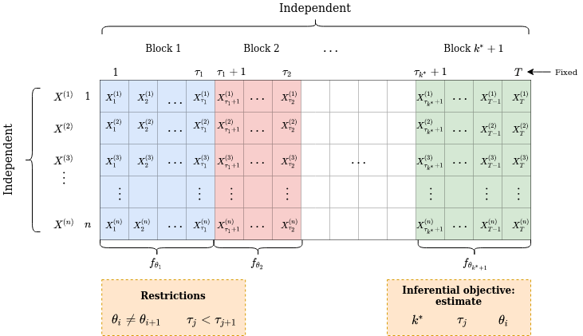

```{r, include = FALSE}
knitr::opts_chunk$set(
  collapse = TRUE,
  comment = "#>"
)
```

```{r setup}
library(blockcpd)
```

  The `blockcpd` package implements a statistical model for automatic
  segmentation of a collection of repeated time series, providing tools to fit
  the model and plot its output. More specifically, it performs a retrospective 
  segmentation in time, creating blocks of variables, which are characterized by 
  having different parameters associated to a distribution chosen by the user.
  
  To better understand the structure of the data and problem considered, the
  figure below illustrates the typical scenario in which the model can be
  applied.
  
  
  We observe that we have a collection of independent identically distributed 
  time series $X^{(i)}$, one per line, which are segmented in blocks. 
  Within each block, the data has density function $f_{\theta_k}$, where 
  $\theta_k$ is the parameter of the $k$-th block. Of course, we do not know the 
  number of blocks, their locations and the parameters of each one. The
  parameters are associated with a distribution chosen by the user. The  
  statistical model implemented in the package uses change point detection
  methodology to estimate these quantities.
  
  In this tutorial, we will show how to install the package, simulate data
  according to the distributions proposed, fit the model and plot its output.
  
## Installation

  A github repository contains the source files for the package. To install it using the [devtools](https://cran.r-project.org/web/packages/devtools/index.html) package, run the following command.
  
```{r eval = FALSE}
devtools::install_github("https://github.com/Lucas-Prates/blockcpd")
```

## Examples
### Simulating data

  To simulate data as specified by the model above, we need to choose the family
  of the distribution. Currently, the package implements the Normal(Gaussian) 
  with unknown mean and variance, Poisson, Exponential, Bernoulli and Binary 
  Markov Chain (2-states) distributions.
  
  Lets simulate data with $n = 1000$ samples (time-series), $m = T = 200$ 
  variables (time indices), segmented in four intervals: $[1, 50]$, $[51, 100]$, 
  $[101, 180]$ and $[171, 200]$. For the distributions, assume that each block
  comes from a Normal distribution: $\mathcal{N}(0, 1)$, $\mathcal{N}(1, 1)$,
  $\mathcal{N}(1, 4)$, $\mathcal{N}(2, 1)$. That is, the first block has mean
  $\mu = 0$ and variance $\sigma^2 = 1$, the second shifts its mean to
  $\mu = 1$ having the same $\sigma^2$, the third increases the variance
  to $\sigma^2 = 4$ and the fourth shifts the mean to $\mu = 2$ and reduces the
  variance back to $\sigma^2 = 1$.
  
  To simulate from this model, we use the `rcpd` function provided by the
  package. Passing $n$, $m=T$ and $k$(number of blocks) and family is 
  straightforward. To pass the parameters, provide a list, where the keys are
  the parameter name for the model, and the value is a vector whose entries
  are the value of that parameter for each block. Finally, blocks are specified
  with the `changepoints` argument, which is a vector containing the end point
  of each block except the last, in our case $(50, 100, 170)$.
   
```{r}
set.seed(204)
parameters = list(mean = c(0, 1, 1, 2),
                  variance = c(1, 1, 4, 1)
                  ) # pass as a list!

sim_df <- rcpd(n = 1000, m = 200, k = 4, 
               family = "normal", parameters = parameters,
               changepoints = c(50, 100, 170) 
              ) 
                        
```
